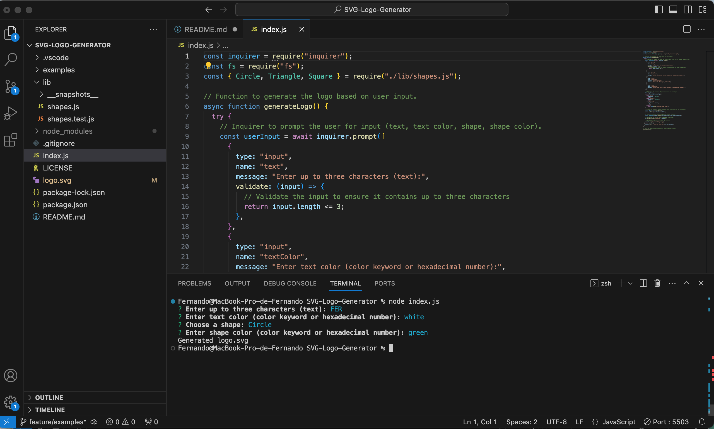
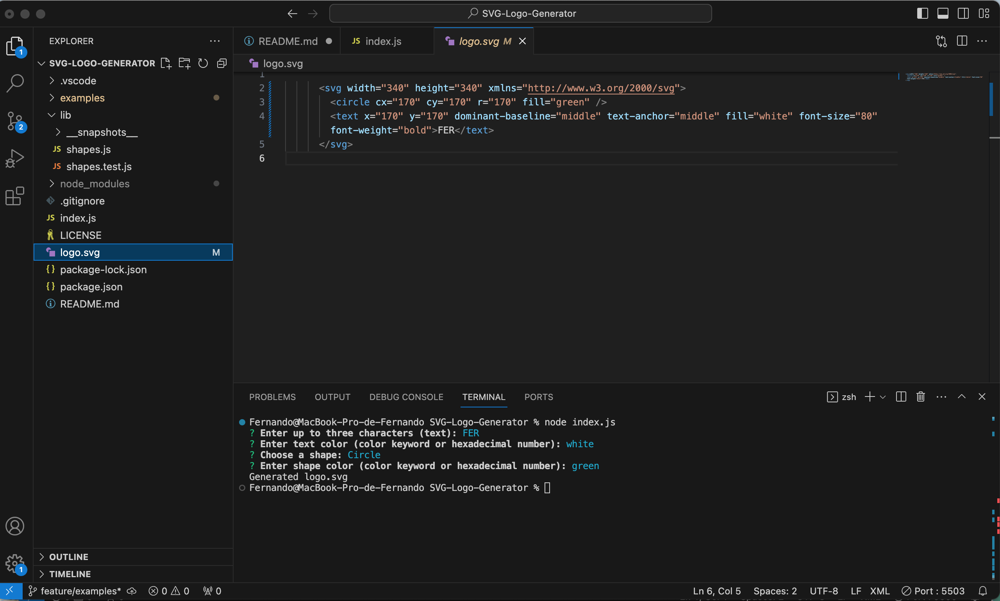
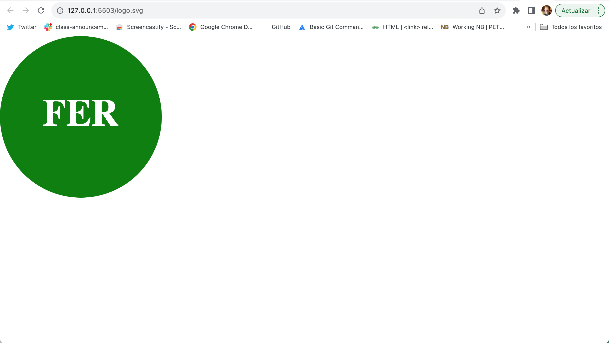
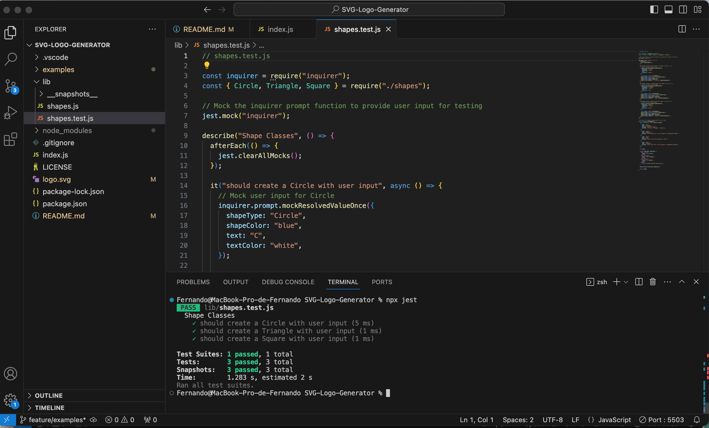

# SVG-Logo-Generator

## Description
This application allows the user to create a SVG logo after choosing one up-to-three letters word, font color, shape, and shape color from an inquirer prompt menu.

[](https://opensource.org/licenses/MIT)

## Table of Contents:

- [Overview](#Overview)
- [The Challenge](#The-Challenge)
- [User Story](#User-Story)
- [Acceptance Criteria](#Acceptance-Criteria)
- [Installation Instructions](#Installation-Instructions)
- [Usage Instructions](#Usage-Instructions)
- [Technologies Used](#Technologies-Used)
- [Video Location](#Video-Location)
- [Screenshots](#Screenshots)
- [Test](#Test)
- [Questions](#Questions)
- [Credits](#Credits)
- [License](#License)

# Overview

## Challenge
In order to reach the goal for this project, I have used: Node, inquirer and fs to run the application, prompt all the questions, retrieve the information needed, and generate the new SVG logo in a file logo.svg which can be run using the browser. Using the comand "node index.js" it is possible to choose the up-to-three letters word, font color, the shape of the logo and color of the geometrical figure.

## User Story

```md
AS a freelance web developer
I WANT to generate a simple logo for my projects
SO THAT I don't have to pay a graphic designer.
```

## Acceptance Criteria

```md
GIVEN a command-line application that accepts user input
WHEN I am prompted for text
THEN I can enter up to three characters
WHEN I am prompted for the text color
THEN I can enter a color keyword (OR a hexadecimal number)
WHEN I am prompted for a shape
THEN I am presented with a list of shapes to choose from: circle, triangle, and square
WHEN I am prompted for the shape's color
THEN I can enter a color keyword (OR a hexadecimal number)
WHEN I have entered input for all the prompts
THEN an SVG file is created named `logo.svg`
AND the output text "Generated logo.svg" is printed in the command line
WHEN I open the `logo.svg` file in a browser
THEN I am shown a 300x200 pixel image that matches the criteria I entered
```

## Installation Instructions
1. Clone this repository into your local environment,  
2. Navigate using the command line into the directory with the index.js file, 
3. Run “npm init -y”, 
4. Check if Inquirer.js: [Version 8.2.4](https://www.npmjs.com/package/inquirer/v/8.2.4) is in the dependencies inside the file package.json, if not, run “npm install inquirer@8.4.2”.
5. Check if Jest [Version 29.7.0](https://www.npmjs.com/package/jest) is in the dependencies inside the file package.json, if not, run “npm install --save-dev jest”.

## Usage Instructions
1. Run “node index.js” to execute the application, 
2. Choose the up-to-three letter word, font color, shape of the logo, and color, 
3. Copy and paste the content of logo.svg” into a new .svg file, 
4. Open the logo.svg file with Live Server.
5. Enjoy the new logo you have created.

## Technologies Used
- Node.js [Version 16.18.1](https://nodejs.org/en/blog/release/v16.18.1/)
- Jest [Version 29.7.0](https://www.npmjs.com/package/jest)
- Inquirer.js: [Version 8.2.4](https://www.npmjs.com/package/inquirer/v/8.2.4)
- Visual Studio Code: [Website](https://code.visualstudio.com/)

## Video Location
[SVG Logo Generator Video](https://drive.google.com/file/d/1ejhlBILsfdlmFizT0aYQhwPeK_R2gj78/view?usp=drive_link)

## Screenshots





## Test
This application has been tested with: Jest [Version 29.7.0](https://www.npmjs.com/package/jest), and the testing file is (./lib/shapes.test.js)

## Questions?

If you have any questions related with this SVG-Logo-Generator, feel free to reach me through:

Email:[fibarrafdec@gmail.com](fibarrafdec@gmail.com)

GitHub username:[fibarrafdec](fibarrafdec)
GitHub link: https://github.com/fibarrafdec

## Credits
This application has been created by © 2023 Fernando Ibarra [fibarrafdec](https://github.com/fibarrafdec).

## License & Copyright ©
This application is covered under the MIT License.
[](https://opensource.org/licenses/MIT)

### Copyright © 2023 Fernando Ibarra
```md
Permission is hereby granted, free of charge, to any person obtaining a copy
of this software and associated documentation files (the "Software"), to deal
in the Software without restriction, including without limitation the rights
to use, copy, modify, merge, publish, distribute, sublicense, and/or sell
copies of the Software, and to permit persons to whom the Software is
furnished to do so, subject to the following conditions:

The above copyright notice and this permission notice shall be included in all
copies or substantial portions of the Software.

THE SOFTWARE IS PROVIDED "AS IS", WITHOUT WARRANTY OF ANY KIND, EXPRESS OR
IMPLIED, INCLUDING BUT NOT LIMITED TO THE WARRANTIES OF MERCHANTABILITY,
FITNESS FOR A PARTICULAR PURPOSE AND NONINFRINGEMENT. IN NO EVENT SHALL THE
AUTHORS OR COPYRIGHT HOLDERS BE LIABLE FOR ANY CLAIM, DAMAGES OR OTHER
LIABILITY, WHETHER IN AN ACTION OF CONTRACT, TORT OR OTHERWISE, ARISING FROM,
OUT OF OR IN CONNECTION WITH THE SOFTWARE OR THE USE OR OTHER DEALINGS IN THE
SOFTWARE.
```
